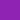

# frontend-toolkit

Implementation of the [Home Office design system](https://github.com/UKHomeOffice/design-system) for use in projects

## HTML components

HTML components are shipped as nunjucks macro functions for maximal compatability with the GDS prototype kit.

### Usage

To use a component inside a nunjucks template, first import the component, then call as a function:

```

{{ header(title='Frontend toolkit') }}
```

#### Using with express

Include the components in your app's `views` stack:

```js
app.set('views', [require('@ukhomeoffice/frontend-toolkit').views, '<your app views directory>']);
```

This will allow simple reference to the components when using them in templates.

#### Using without express

If you are not using express, and so cannot make use of its `views` stack, then you will need to provide a full path
when importing components. The easiest way to do this is to expose a `componentPath` property to your templates.

```


{{ header(title='Frontend toolkit') }}
```

### Components

The following components are available:

* [header](./docs/components/header.md)
* [footer](./docs/components/footer.md)

## Styles

The default css styles are provided as sass files. To include these in a project add the following line to your
project's sass:

```sass
@import "@ukhomeoffice/frontend-toolkit";
```

Note: you will need to set the `includePaths` option in your sass compiler to include your project's local
`node_modules` directory.

### Components

The header and footer styling is automatically included with the core styles. For all other components, including the
proxies to `govuk-frontend` components, you will need to import each sass file individually:

```sass
@import '@ukhomeoffice/frontend-toolkit/assets/styles/components/breadcrumbs';
@import '@ukhomeoffice/frontend-toolkit/assets/styles/components/error-summary';
@import '@ukhomeoffice/frontend-toolkit/assets/styles/components/phase-banner';
```

### Colours

A number of colour variables are defined in sass as shortcuts

*  `$ho-brand` - `#8F23B3` (alias `$purple`)
*  `$background` - `#F3F3F3` (alias `$light-grey`)
*  `$black` - `#0B0C0C`
*  `$green` - `#3D5C00`
*  `$blue` - `#005EA5`
*  `$dark-grey` - `#3B3B3B`
*  `$mid-grey` - `#DADADA`
